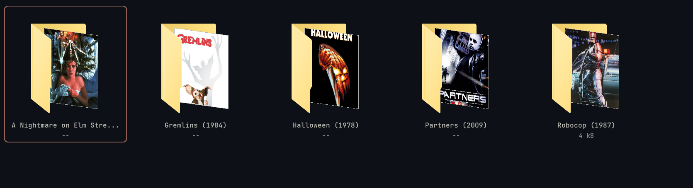
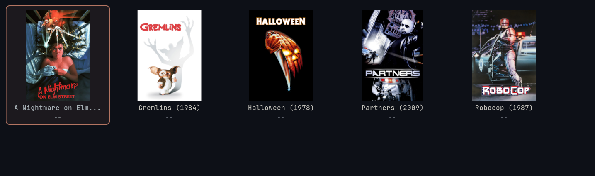

# nc_icon

**nc_icon** is a Windows command-line tool that automatically sets folder icons to movie posters (or artwork) found inside each folder. It can also intelligently rename common artwork files to standardized names.

### Before

### After


## Features

- **Automatic icon generation**: Finds `poster.jpg`, `folder.png`, or similar artwork in a folder and creates a `folder.ico` from it
- **Smart renaming**: Renames common artwork files to standardized names:
  - `*-poster.*` → `folder.*`
  - `*-clearlogo.*` → `logo.*`
  - `*-fanart.*` → `fanart.*`
  - `*-disc.*` → `disc.*`
  - `*-banner.*` → `landscape.*`
  - `cover_art.*` → `folder.*`
- **Recursive processing**: Processes all subdirectories within the target folder
- **Multithreaded**: Uses parallel processing for faster performance
- **Dry-run mode**: Preview changes without making any modifications
- **Custom icon size**: Specify the icon size (16, 32, 48, 64, 128, or 256 pixels)

## Usage

```cmd
nc_icon [directory] [options]
```

### Command-Line Arguments

| Argument | Description |
|----------|-------------|
| `[directory]` | Target directory to process (defaults to current directory) |
| `--dry-run`, `-d` | Preview what would be done without making changes |
| `--icon-size N`, `-s N` | Set icon size (16, 32, 48, 64, 128, or 256). Default: 256 |
| `--no-rename` | Disable automatic renaming of artwork files |
| `--verbose`, `-v` | Show detailed output during processing |

### Examples

Process the current directory with default settings:
```cmd
nc_icon
```

Process a specific directory:
```cmd
nc_icon "C:\Movies\Collection"
```

Preview changes for a directory without making modifications:
```cmd
nc_icon "D:\TV Shows" --dry-run
```

Use a custom icon size (64x64 pixels):
```cmd
nc_icon --icon-size=64
```

Process without renaming files:
```cmd
nc_icon --no-rename
```

Verbose mode showing detailed output:
```cmd
nc_icon --verbose
```

Combining multiple options:
```cmd
nc_icon "E:\Media" --icon-size=128 --dry-run --verbose
```

## How It Works

1. **Scans directories**: Recursively scans the target directory for subfolders
2. **Renames artwork**: If `--no-rename` is not set, renames common artwork patterns to standardized names (`poster` → `folder`, `fanart` → `fanart`, etc.)
3. **Finds artwork**: Looks for `folder.jpg`, `poster.jpg`, `folder.png`, or `poster.png` in each folder
4. **Creates icon**: Converts the artwork to an ICO file centered on a transparent background
5. **Configures folder**: Creates a `desktop.ini` file and sets folder attributes to display the custom icon
6. **Refreshes Explorer**: Notifies Windows Explorer to show the new icons

## Output Summary

After processing, nc_icon displays:
- Number of folders successfully configured
- Number of failed configurations
- Total folders processed

## Requirements

- **Windows OS** (uses Windows API for folder icon customization)
- No additional dependencies required

## Building

The project uses a custom build system. Run `build.bat` from the project root:

```cmd
build.bat
```

> [!WARNING]
> Requires cl.exe, link.exe and ml64.exe to be installed and on path in order
> to compile and link


## Notes

- The tool processes folders recursively by default
- Hidden and system folders are skipped
- The `desktop.ini` file is created as a hidden system file
- Target folders are marked as read-only (required for custom icons in Windows, however I have not had any problems with this)
